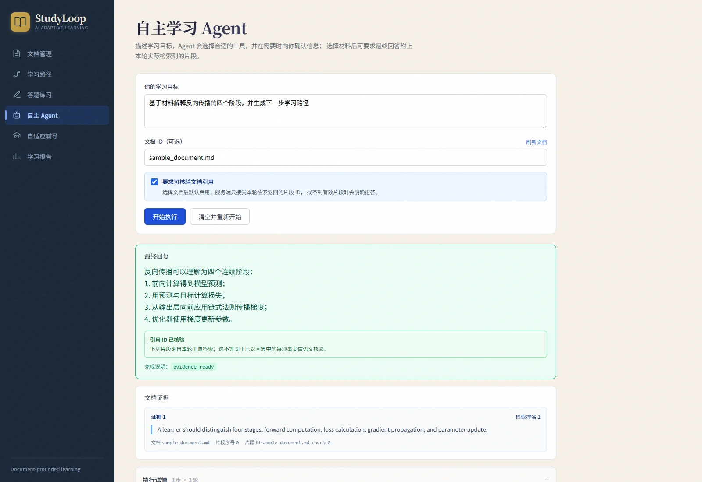
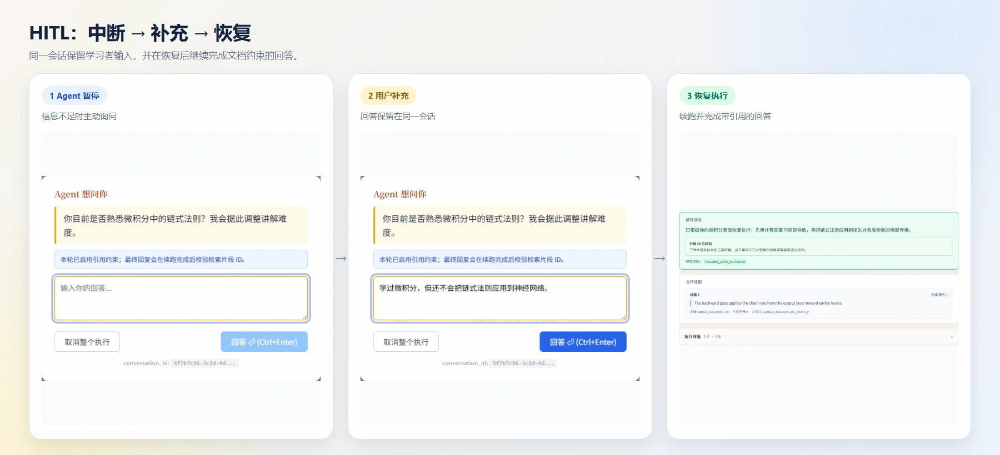
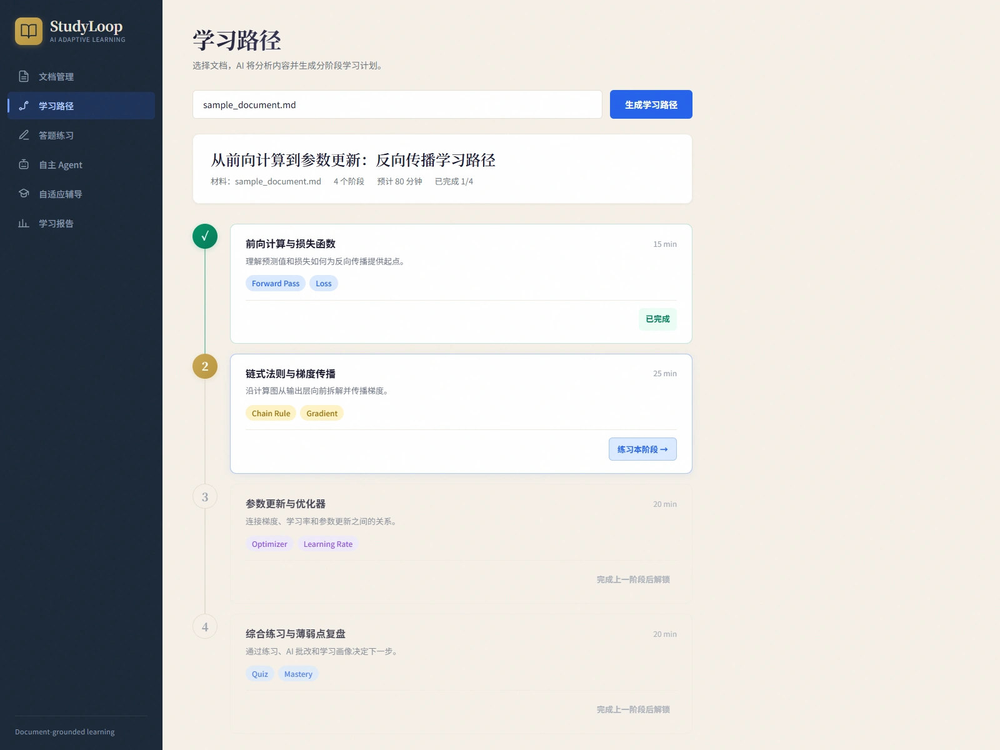

# StudyLoop

[](https://github.com/tx3457/study-loop/actions/workflows/ci.yml)

**Document-grounded adaptive tutoring with bounded tool-use agents.**

StudyLoop 是一个基于个人学习材料的 AI 自适应学习系统：从文档检索与引用、学习路径、Quiz、AI 批改，到可中断和恢复的工具调用 Agent，形成完整的学习闭环。

## 产品演示

<p align="center">
  <a href="docs/assets/autonomous-grounded.webp">
    
  </a>
</p>

<p align="center"><sub>选择学习材料后，Agent 调用受限业务工具，并把本轮检索证据与执行过程返回到界面。</sub></p>

<p align="center">
  <a href="docs/assets/hitl-resume.webp"></a>
  <a href="docs/assets/learning-loop.webp"></a>
</p>

<p align="center"><sub>左：HITL 中断、补充与恢复的完整流程；右：学习路径按完成状态依次解锁。截图使用仓库内的反向传播示例材料展示同一条学习流程。</sub></p>

## 核心亮点

- **可选领域知识库**：LightRAG 将多份材料组织为同一知识图谱，支持知识库隔离、图谱纠错、跨文档引用，以及可选联网搜索和主动收录网页。独立服务部署，默认关闭；见[启用与验证说明](docs/LIGHTRAG.md)。
- **文档驱动学习**：解析 PDF、DOCX、Markdown、文本和图片，Chroma 与 BM25 混合检索并用 RRF 融合。引用校验基于每轮独立的证据登记表：模型引用本轮未检索到的片段会被判定无效，开启 grounding 后没有有效引用则安全弃答。
- **有界工具 Agent**：模型只能从注册表白名单选择业务工具，越界调用被拦截并回灌错误 observation；工具参数由服务端权威绑定，模型无法伪造上游工具的产出；并行工具批次拒绝「副作用写入 + 结束」的混合调用。执行上限 8 轮，超限强制收尾并标记 `max_rounds_truncated`。
- **可续跑的 HITL**：Agent 需要补充信息时暂停并持久化快照，由独立端点续跑。会话认领使用 CAS 与 fencing token；恢复时比对工具契约指纹，工具定义变更后不允许旧会话续跑。
- **自适应学习闭环**：学习路径、Quiz、AI 批改、错题与学习画像共同决定下一阶段或下一轮辅导动作。
- **可恢复的 Web 工作流**：Learning Path、Quiz、Adaptive 和 Autonomous 使用幂等请求、服务端会话与持久化快照处理刷新、断网、响应丢失和后端重启。
- **工程化交付**：提供 Docker Compose、PostgreSQL/SQLite 状态存储、Pytest、Playwright E2E、前端构建检查和容器 smoke test。

## 系统架构

<p align="center">
  <a href="docs/assets/architecture.svg">
    
  </a>
</p>

主学习流程是：

1. 上传材料并完成解析、切分和检索建库。
2. 从材料生成学习路径或 Quiz，完成作答与 AI 批改。
3. 将掌握度、薄弱点和学习事件写入学习画像。
4. Adaptive workflow 或 Autonomous Agent 根据当前状态选择下一步；需要更多信息时通过 HITL 暂停。

Autonomous 是模型选择工具的有界 Agent；Adaptive 是模型选择结构化教学动作、由应用执行固定分支的 agentic workflow。详细执行边界见 [`docs/ARCHITECTURE.md`](docs/ARCHITECTURE.md)。

## Quick Start

推荐使用 Docker Compose 启动完整本地环境：

```bash
cp .env.example .env
# 配置模型服务，并设置非空 POSTGRES_PASSWORD
docker compose up --build -d --wait
```

启动后访问：

- Web：<http://localhost:4001>
- API 文档：<http://localhost:8001/docs>

默认拓扑只绑定本机回环地址，不发布 PostgreSQL 端口，并固定使用一个 backend worker。Provider 配置、健康检查和可选能力见 [`docs/CONFIGURATION.md`](docs/CONFIGURATION.md)；本地开发与测试命令见 [`docs/DEVELOPMENT.md`](docs/DEVELOPMENT.md)。

示例学习材料位于 [`examples/sample_document.md`](examples/sample_document.md)。

## 技术栈

| Layer | Technologies |
| --- | --- |
| Web | React 19, React Router, Vite |
| API | FastAPI, Pydantic, Uvicorn |
| Agent and workflows | LangGraph, LangChain |
| Retrieval | Chroma, BM25, optional query rewriting / HyDE / reranking |
| State | PostgreSQL, SQLite, learner-memory snapshots |
| Delivery and quality | Docker Compose, GitHub Actions, Pytest, Playwright |

## 产品边界

Web 产品主线包括文档管理、学习路径、答题练习、自主 Agent、自适应辅导和学习报告。

另有若干默认注册、在认证门内但没有 Web 界面的端点，可以直接调用；它们的执行风格与停止条件见[架构与执行边界](docs/ARCHITECTURE.md)。

引用校验保证片段 ID 来自本轮、指定文档范围内的检索结果，但不等同于对回答中每一项事实完成语义核验。文档删除是“仅删除材料”，不会级联清除已经形成的学习历史和会话工件。完整边界见架构与安全文档。

## 文档

- [架构与执行边界](docs/ARCHITECTURE.md)
- [配置、Provider 与运行说明](docs/CONFIGURATION.md)
- [本地开发与验证](docs/DEVELOPMENT.md)
- [A/B 评测与 LLM-as-Judge](docs/EVALUATION.md)
- [安全与数据处理](SECURITY.md)
- [产品与界面设计](DESIGN.md)

## License

Copyright (c) 2026 tx3457. All rights reserved. See [LICENSE](LICENSE).
